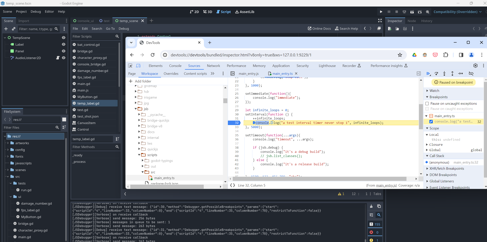

JavaScript for Godot with V8

> THIS PROJECT IS STILL UNDER VERY EARLY DEVELOPMENT.

## Features
* [x] Support on-demand binding
* [x] Essential NodeJS compatibilities (`console` , `timers` and `CommonJS` modules)
* [ ] Godot Object binding
* [ ] Godot `ScriptLanguage` integrating
* [ ] Multiple contexts for sandboxing script environments (not multi-threading)
* [ ] Support hot-reload
* [ ] Worker threads implementation
* [ ] C++ binding (very basically)
* [ ] Seamlessly switch to QuickJS when targeting web platform
* [x] Debug with Chrome devtools when using V8

## Current State

| Platform | V8 | QuickJS |
| --- | --- | --- |
| Windows x86_64 | INTEGRATING | TODO |
| Windows x86_32 | UNPLANNED | UNPLANNED |
| UWP | UNPLANNED | UNPLANNED |
| Windows ARM64 | TODO | TODO |
| Linux x86_64 | TODO | TODO |
| MacOS x86_64 | TODO | TODO |
| MacOS ARM64 | INTEGRATING | TODO |
| WebAssembly | X | TODO |


| Runtime | Version |
| --- | --- |
| v8 | 12.4 |
| quickjs | 2024-01-13 |
| godot | 4.2 |

## Sample

```ts
// godot types will be exposed to JS runtime until they are actually used
import { Node } from "godot";

// entry point (editor only)

// log, warn, error, assert are essentially supported
console.log("main entry in editor");
console.assert(typeof Node === "function");

let timer_id : any;
let times = 5;

// setInterval, setTimeout, setImmediate, clearInterval, clearTimeout are essentially supported
// NOTE: they return a timer_id which is an integer instead of Timeout object like in NodeJS
timer_id = setInterval(function () {
    console.log("tick");
    --times;
    if (times == 0) {
        clearInterval(timer_id);
        console.log("stop tick");
    }
}, 1000);

setImmediate(function(){
    console.log("immediate");
});

setTimeout(function(...args){
    console.log("timeout", ...args);

    if (jsb.debug) {
        console.log("it's a debug build");
        // jsb.list_classes();
    } else {
        console.log("it's a release build");
    }

}, 1500, 123, 456.789, "abc");

async function delay(seconds: number) {
    return new Promise(function (resolve: (value?: any) => void) {
        setTimeout(function () {
            resolve();
        }, seconds * 1000);
    });
}

async function test_async() {
    console.log("async test begin");
    await delay(3);
    console.log("async test end");
}

test_async();
```

## Debugger


